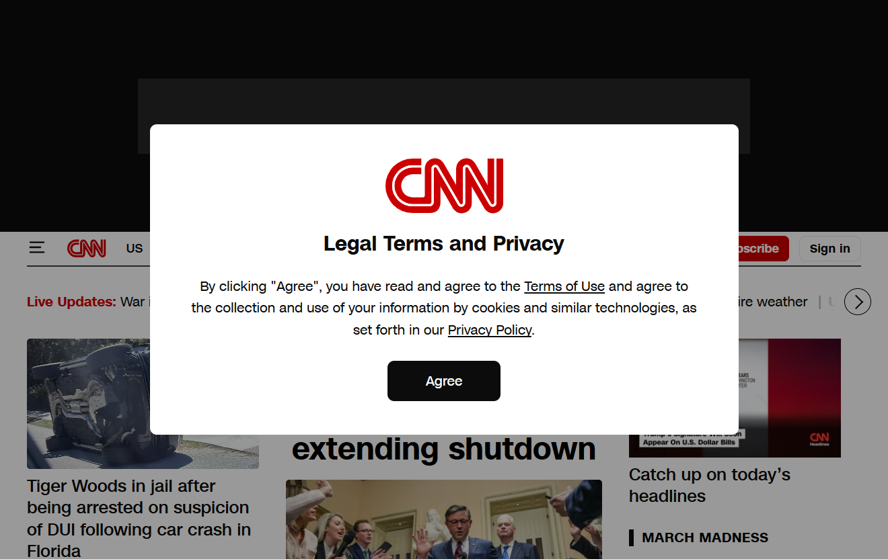

# CNN.com — Website Health Report
**Generated:** 2026-03-27
**URL:** https://www.cnn.com
**Tools used:** chrome-devtools-mcp (navigate, screenshot, console, network, performance trace × 7 insights)

---



---

## TL;DR — Overall Health

| Area | Score | Verdict |
|------|-------|---------|
| Core Web Vitals | LCP 1.5s / CLS 0.01 / INP 145ms | ✅ All Green |
| Third-party payload | 52+ vendors, 2.5MB Wunderkind alone | 🔴 Critical |
| Forced reflows | 3,906ms of layout thrashing | 🔴 Critical |
| DOM size | 5,874 elements, depth 43 | 🟠 Warning |
| Cache policy | Fonts TTL=0, images TTL=300s | 🟠 Warning |
| Console errors | 3 errors, 7 warnings | 🟡 Minor |

**Summary:** CNN's raw Core Web Vitals are surprisingly healthy in a lab environment, but the page is weighed down by an extraordinary ad-tech stack — 52+ third-party vendors that collectively consume thousands of milliseconds of main-thread time, drive nearly 4 seconds of forced layout thrashing, and download megabytes of tracking and advertising JavaScript. For real users on slower connections or devices, this would be significantly worse.

---

## 1. Core Web Vitals

Measured via Chrome performance trace (real page load, no throttling).

| Metric | Lab (this run) | Field (CrUX p75, real users) | Threshold |
|--------|---------------|------------------------------|-----------|
| **LCP** — Largest Contentful Paint | 1,556 ms | 1,547 ms | ✅ Good (< 2,500ms) |
| **CLS** — Cumulative Layout Shift | 0.01 | 0.04 | ✅ Good (< 0.1) |
| **INP** — Interaction to Next Paint | — | 145 ms | ✅ Good (< 200ms) |

> Field data comes from CrUX (Chrome User Experience Report) — the p75 measure of all real Chrome users visiting CNN.

### LCP Breakdown

The LCP element is the main headline (`H2.container__title_url-text`) — a text node, not an image.

| Phase | Time | % of total |
|-------|------|-----------|
| Time to First Byte (TTFB) | 19 ms | 1.2% |
| **Element render delay** | **1,537 ms** | **98.8%** |
| **Total LCP** | **1,556 ms** | 100% |

**Finding:** CNN's server is extremely fast (19ms TTFB). The entire LCP cost is render delay — the browser receives the HTML almost instantly but is blocked from rendering the headline for 1.5 seconds by JavaScript loading and execution. The headline is in the DOM; it just can't paint until render-blocking scripts finish.

---

## 2. Third-Party Scripts — The Biggest Problem

CNN loads scripts from **52+ third-party domains**. This is the root cause of most other issues on this page.

### Transfer size by vendor (top 10)

| Vendor | Transfer Size | Purpose |
|--------|-------------|---------|
| Wunderkind | **2.5 MB** | Behavioural marketing |
| Google/Doubleclick Ads | 1.1 MB | Ad serving |
| Integral Ad Science | 705 KB | Ad fraud detection |
| Optimizely | 652 KB | A/B testing |
| Piano | 594 KB | Subscription management |
| Outbrain | 589 KB | Content recommendations |
| Amazon Ads | 453 KB | Ad serving |
| Pubmatic | 306 KB | Ad exchange |
| script.ac | 288 KB | Ad fraud detection |
| Other Google APIs | 258 KB | Miscellaneous |

**Total third-party transfer: ~8+ MB** of JavaScript and tracking pixels.

### Main thread time by vendor (top 10)

This is what actually hurts users — time the browser's main thread is busy running third-party code, unable to respond to user input.

| Vendor | Main Thread Time |
|--------|----------------|
| cnn.io (first-party CDN) | 3,052 ms |
| script.ac | 2,209 ms |
| Integral Ad Science | 1,233 ms |
| Wunderkind | 1,178 ms |
| Google/Doubleclick Ads | 1,041 ms |
| Optimizely | 512 ms |
| Outbrain | 325 ms |
| Amazon Ads | 307 ms |
| Pubmatic | 234 ms |
| Piano | 158 ms |

**Finding:** Third-party scripts consume well over **10 seconds of combined main thread time** during a single page load. Even with modern browsers parallelising some of this, it contributes directly to the render delay seen in the LCP breakdown.

---

## 3. Forced Reflows — 3,906ms of Layout Thrashing

**Total forced reflow time: 3,906 ms**

A forced reflow happens when JavaScript reads layout properties (like `offsetWidth` or `getBoundingClientRect`) immediately after modifying the DOM. The browser is forced to stop, recalculate the entire layout, and then return the answer — this is one of the most expensive things a browser can do.

### Top culprits

| Script | Time | Source |
|--------|------|--------|
| `script.ac` (ad fraud) | contributed to root cause | `ft()` at `cadmus.script.ac` |
| `adsafeprotected.com` `r()` | **2,386 ms** | Ad verification |
| `boltPlayer` `Fc()` | **1,470 ms** | CNN video player |
| `boltPlayer` `getSize()` | **622 ms** | CNN video player |
| `outbrain.js` `c.FM()` | **818 ms** | Content recommendations |
| `tinypass.min.js` `i()` | **632 ms** | Subscription paywall |
| `outbrain.js` `Ug()` | **444 ms** | Content recommendations |
| `cxense` `cx.js` | **356 ms** | Audience analytics |
| `adsafeprotected` `getRect()` | **324 ms** (Outbrain slot) | Ad verification |

**Finding:** Ad verification scripts (`adsafeprotected.com`), the CNN video player (`boltPlayer`), and content recommendation widgets (Outbrain) are the primary layout-thrashing offenders. These scripts repeatedly measure element positions while modifying the DOM — a classic anti-pattern that cascades into thousands of milliseconds of wasted layout work.

---

## 4. DOM Size

| Metric | Value | Lighthouse Threshold |
|--------|-------|---------------------|
| Total elements | **5,874** | ⚠️ Excessive (> 1,500) |
| Maximum DOM depth | **43 nodes** | ⚠️ Deep (> 32) |
| Most children on one element | **49** (BODY) | — |

### Impact on layout performance

| Event | Duration | Nodes affected |
|-------|----------|---------------|
| Layout update | 69 ms | 5,042 of 5,042 |
| Layout update | 55 ms | 5,043 of 5,043 |
| Style recalculation | 114 ms | 1,090 elements |
| Style recalculation | 63 ms | 650 elements |
| Style recalculation | 60 ms | 2,290 elements |

**Finding:** When a forced reflow occurs on a 5,874-node DOM, every layout recalculation is expensive — the browser has to measure positions for thousands of elements. The forced reflow problem and the DOM size problem multiply each other.

---

## 5. Cache Policy Issues

Several important resources are served with very short (or zero) cache lifetimes, meaning browsers cannot cache them between visits.

### Critical: CNN custom fonts have TTL = 0

```
https://ix.cnn.io/static/fonts/latest/cnnsans-regular.woff2   TTL: 0s
https://ix.cnn.io/static/fonts/latest/cnnsans-bold.woff2      TTL: 0s
https://ix.cnn.io/static/fonts/latest/cnnsans-italic.woff2    TTL: 0s
```

Fonts almost never change. These should be cached for at least a year (`Cache-Control: max-age=31536000, immutable`). Every page load re-downloads CNN's custom font files.

### Other short-lived resources

| Resource | Current TTL | Recommended |
|----------|------------|-------------|
| All `media.cnn.com` images | 300s (5 min) | 86,400s+ (news images change, but 5min is too short) |
| `registry.api.cnn.io` JS bundles | 600s (10 min) | Long-lived with hash-based filenames (already hashed!) |
| `lightning.cnn.com` launch scripts | 600s (10 min) | Long-lived with content hash |
| `zion-web-client.min.js` | 0s | Should have a TTL |

**Finding:** CNN uses hash-based filenames on most of its JS bundles (e.g. `ui-34be6e59`), which means they can safely be cached forever — but they're only being cached for 10 minutes. This wastes bandwidth on repeat visits.

---

## 6. Console Errors & Warnings

| ID | Type | Message |
|----|------|---------|
| 141 | 🔴 Error | Failed to load resource: 410 Gone |
| 142 | 🔴 Error | Failed to load resource: 410 Gone |
| 148 | 🔴 Error | Attestation check for Protected Audience on `openwebmp.com` failed |
| 168 | 🟡 Warning | `[GPT]` Using deprecated `googletag.encryptedSignalProviders` — use `secureSignalProviders` |
| 173 | 🟡 Warning | iframe with `allow-scripts` + `allow-same-origin` can escape sandboxing |
| 174–175 | 🟡 Warning | iFrameResizer timeout — health widget not responding within 5s |
| 137 | 🟡 Warning | `overflow: visible` on img/video may produce visual content outside bounds |
| 183–186 | 🟡 Warning | DRM robustness level not specified (2× for video player) |

**Key findings:**
- **2× 410 Gone** — CNN is requesting resources that no longer exist on its own servers. These are likely stale references from a previous deploy.
- **Sandbox escape** — An ad or tracking iframe has both `allow-scripts` and `allow-same-origin`, which allows it to break out of its sandbox. This is a security concern.
- **Deprecated GPT API** — Google Ad Manager is warning CNN to migrate from `encryptedSignalProviders` to `secureSignalProviders`.

---

## 7. Top 5 Recommendations

### 1. 🔴 Audit and defer third-party scripts
CNN loads 52+ third-party vendors **synchronously** during page load. Defer non-critical scripts (analytics, A/B testing, ad verification) using `async`/`defer` or load them after the `load` event. Wunderkind alone (2.5MB) and script.ac (2.2 seconds of main thread time) should be deferred — they have no role in rendering the page.

**Impact:** Would directly reduce the 1,537ms render delay on LCP and reduce total main thread blocking time by several seconds.

### 2. 🔴 Fix forced reflows in ad verification and video player
The `adsafeprotected.com` scripts, `boltPlayer`, and Outbrain widgets collectively cause 3,906ms of layout thrashing by reading layout properties inside write loops. The pattern to fix:
```js
// ❌ Causes reflow on every iteration
elements.forEach(el => { el.style.width = el.offsetWidth + 'px'; });

// ✅ Batch reads first, then writes
const widths = elements.map(el => el.offsetWidth);
elements.forEach((el, i) => { el.style.width = widths[i] + 'px'; });
```

**Impact:** Could recover 2–4 seconds of main thread time.

### 3. 🟠 Fix cache headers for CNN custom fonts
Set `Cache-Control: max-age=31536000, immutable` on the three `cnnsans-*.woff2` font files. Fonts are static assets — they should never expire. Currently set to TTL=0, meaning every single page load re-downloads them.

**Impact:** Reduces repeat-visit bandwidth and speeds up subsequent page loads for returning users.

### 4. 🟠 Increase cache TTL for hashed JS bundles
Resources like `registry.api.cnn.io/bundles/fave/ui-34be6e59/ui` already include a content hash in the URL — they can safely be cached forever. Changing from TTL=600s to TTL=31536000s would eliminate unnecessary network requests on repeat visits.

**Impact:** Faster repeat visits, reduced CDN costs.

### 5. 🟡 Reduce DOM size
5,874 DOM elements is nearly 4× the recommended maximum. Consider:
- Lazy-rendering off-screen article cards only when they scroll into view
- Using virtual scrolling for the infinite feed
- Removing duplicate wrappers added by ad containers

**Impact:** Every layout recalculation (of which there are many, due to ad scripts) becomes proportionally faster as the DOM shrinks.

---

## Appendix: Tools Used

| Tool | What it revealed |
|------|----------------|
| `navigate_page` | Opened CNN, handled consent dialog |
| `take_screenshot` | Visual state of the page |
| `list_console_messages` | 3 errors, 7 warnings including 410s and sandbox escape |
| `list_network_requests` | 200+ requests, 8+ MB of third-party JS |
| `performance_start_trace` + `stop_trace` | Core Web Vitals, LCP breakdown, insight list |
| `performance_analyze_insight` × 4 | ThirdParties, LCPBreakdown, ForcedReflow, Cache, DOMSize |

*Note: `lighthouse_audit` timed out on CNN due to the page's extreme complexity. All performance data in this report comes from the Chrome DevTools performance trace, which provides lower-level and more precise data than Lighthouse for a page of this scale.*
